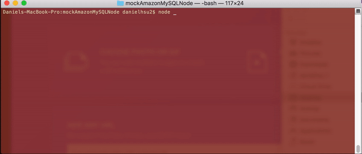
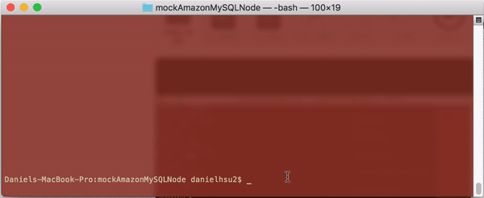

# mockAmazonMySQLNode
Working with mySQL and Node.js to make a mock Amazon store front.

# Using the App  
After you load it and run `npm install` you'll want to use the bamazon.sql and the department.sql to create the database format this app utilizes. Afterwards you can use the app through the node command `node bamazonCustomer.js`, this also applies to the other 2 files bamazonManager.js and bamazonSupervisor.js.

# How the App Works
We're essentially simulating an e-Commerce store through 3 perspectives, the customer, the manager, and the supervisor. Their respective .js files have unique menus that interact with the products database in different ways. Each of their changes affect one another since they all use the same database.

# Watch the App in Action

# Built With
- JavaScript
- Node.js
- SQL
- [Inquirer](https://github.com/SBoudrias/Inquirer.js/)
- [mysql](https://www.npmjs.com/package/mysql)
- [CLI-Table](https://www.npmjs.com/package/cli-table)
- [Chalk](https://www.npmjs.com/package/chalk)

# Version
1.0.0

# Author
Daniel Hsu
